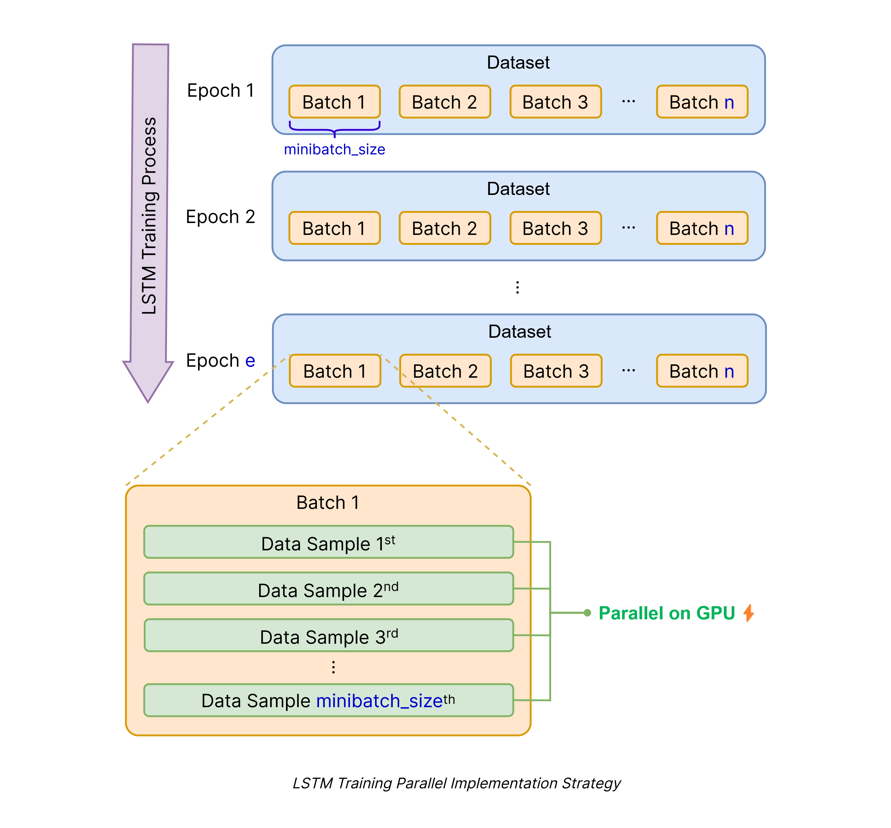
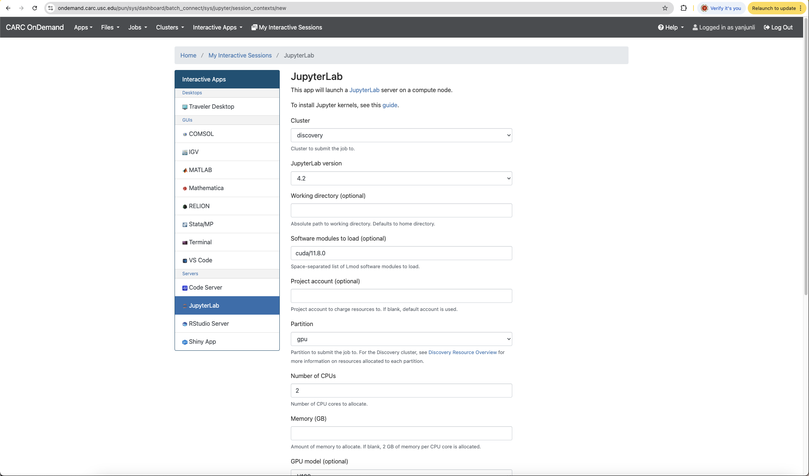
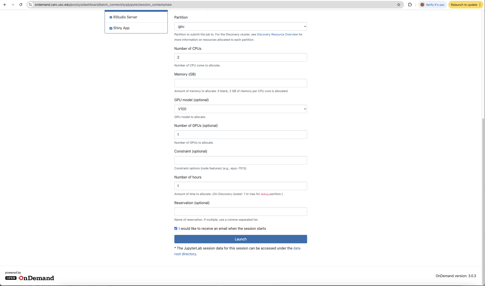
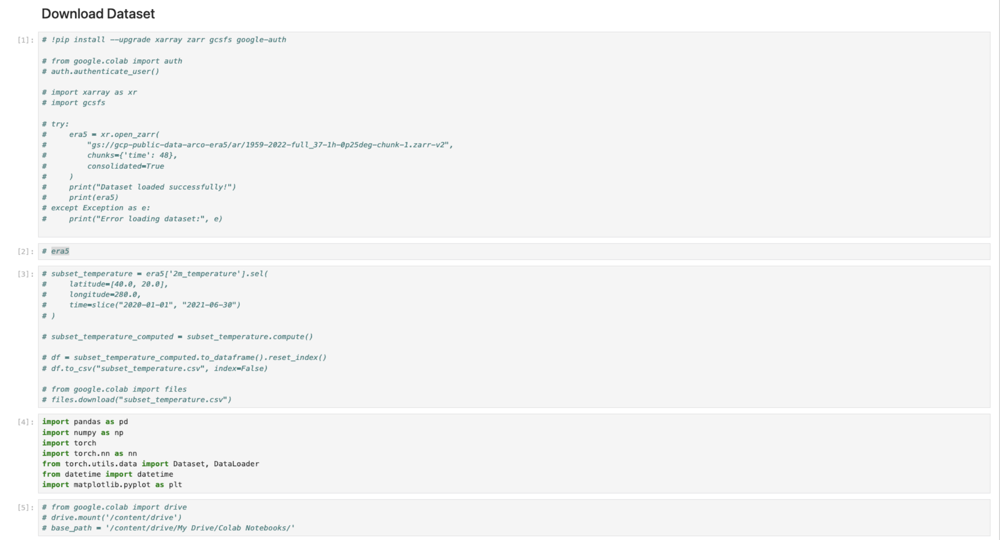
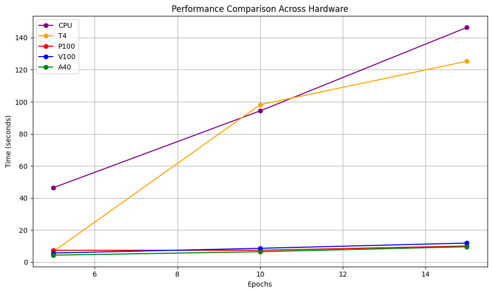

# CSCI-596 Final Project
In this project, our goal is to study how parallel processing techniques can improve the training speed of LSTM models, a type of Recurrent Neural Network (RNN). We will benchmark the efficiency of training the same model using GPU-based computing compared to CPU-based computing, focusing on how GPU acceleration reduces training time. Additionally, we will evaluate the performance of different GPUs, such as Nvidia T40, P100, V100, A40, and A100, to analyze their impact on model training efficiency.

# Team
* Wen Lin
* Yanjun Liu
* Yuchen Xie
  
# Reference

- **Parallel LSTM for Sequence Prediction from Sequential Data:** [GitHub](https://github.com/baobuiquang/ParallelLSTM/tree/main)
  
# Dataset
## Information
Dataset Name: ERA5 Weather Dataset

Description:
* ERA5 provides hourly weather data on a global scale. The Google Cloud Public Dataset Program hosts ERA5 data that spans from 1940 to May 2023.
* The dataset includes multiple features (e.g., temperature, humidity, wind speed) at high spatial and temporal resolutions, which makes it computationally intensive to process sequentially.

Google Cloud Link: https://cloud.google.com/storage/docs/public-datasets/era5
## Task to solve
Predict temperature for a certain Location.

Since weather data is continuous and has strong time dependencies, LSTMs are designed to handle this. 

# Parallel Strategy
There are several parallel strategies for improving the efficiency of LSTM models, such as data parallelism, model parallelism, and temporal parallelism, among others. In this project, we are using data parallelism, which splits the dataset into smaller chunks and processes them in parallel on GPUs, as illustrated in the figure below.



# Code analysis and configuration environment explanation
We use Google Colab to run our models on a Tesla T4 GPU configuration, while on CARC, we run models using NVIDIA P100, V100, A40, and A100 GPU configurations. For CPU-based tasks, both Colab and CARC platforms are suitable options depending on the computational requirements and availability

## Run in Google colab (Tesla T4 GPU or CPU)
- Change your runtime type to certain type(T4 or CPU)
- if you are trying to run on the google colab, you have to import all these libraries for the enviorment set up
    ```python
    !pip install --upgrade xarray zarr gcsfs google-auth
    import xarray as xr
    import gcsfs
    import pandas as pd
    import numpy as np
    import torch
    import torch.nn as nn
    from torch.utils.data import Dataset, DataLoader
    from datetime import datetime
    import matplotlib.pyplot as plt
    ```
  - xarray and zarr: For efficient loading and manipulation of large multi-dimensional arrays.
  - gcsfs: Provides filesystem-like access to data in Google Cloud Storage.
  - torch: The PyTorch library, used for building and training neural networks.
  pandas, numpy, matplotlib: For data processing and plotting.

- Next, the code uses Google Colab's authentication service to access data stored on Google Cloud Storage, loading the ERA5 climate dataset:
    ```python
    from google.colab import auth
    auth.authenticate_user()

    try:
        era5 = xr.open_zarr("gs://gcp-public-data-arco-era5/ar/1959-2022-full_37-1h-0p25deg-chunk-1.zarr-v2", chunks={'time': 48}, consolidated=True)
        print("Dataset loaded successfully!")
    except Exception as e:
        print("Error loading dataset:", e)
    ```
- The code selects temperature data for specific geographic locations and time periods from the dataset and processes it:
    ```python
    subset_temperature = era5['2m_temperature'].sel(latitude=[40.0, 20.0], longitude=280.0, time=slice("2020-01-01", "2021-06-30"))
    subset_temperature_computed = subset_temperature.compute()
    df = subset_temperature_computed.to_dataframe().reset_index()
    df.to_csv("subset_temperature.csv", index=False)
    ```
- then we train the model can calculate the time of training.

## Run on CARC in JupyterLab
- Environment requirement:
  - pytorch 2.5.0
  - cuda 11.8.0
  - CUDA toolkit
- To use JupyterLab on CARC, you first need to install Jupyter kernels. Follow the instructions on this website to create a new Jupyter kernel.[CARC Installing Jupyter Kernels](https://www.carc.usc.edu/user-guides/hpc-systems/software/jupyter-kernels.html)
- Next, follow the instructions on this website to start an interactive session.[CARC Interactive Apps](https://www.carc.usc.edu/user-guides/carc-ondemand/interactive-apps.html)


- For our experiment, we choose Partition as GPU, Numbers of CPU is 2, GPU model can change to P100, V100, A40 and A100, Number of GPU is 1.
- if you are running the code in CARC, you can ignore the following code:


# Result
## Comparison
- ### num_work = 2
  |  | CPU | T4 | P100 | V100 | A40 |
  |-------|-------|-------|-------|-------|-------|
  | Epoch=5 | 46.42 | 6.62 | 7.39 | 5.67 | 4.34 | 
  | Epoch=10 | 94.34 | 98.20 | 7.39 | 8.61 | 6.49 | 
  | Epoch=15 | 146.41 | 125.33 | 10.04 | 11.89 | 9.58 | 



# Discussion
Based on the results presented in the table, we can draw the following conclusions in relation to our project goal of studying parallel processing techniques for improving LSTM model training speed:
1. GPU Acceleration vs. CPU:
   - The results clearly demonstrate that GPU-based computing significantly reduces training time compared to CPU-based computing across all tested scenarios. For example, for Epoch=5, the CPU took 46.42 seconds, whereas the GPUs (T4, P100, V100, A40) reduced the time to the range of 4.34 to 7.39 seconds, showcasing the effectiveness of parallel processing on GPUs. Moreover, this trend is consistent as the number of epochs increases, highlighting the scalability of GPU acceleration for larger training tasks.
2. Performance Comparison Between GPUs:
   - Among the tested GPUs: as we expected, the A40 GPU consistently outperformed the others, achieving the fastest training times across all epoch settings. However, it was unexpected that the P100 outperformed both the V100 and T4 in terms of training speed as the number of epochs increased. We believe this may be due to the P100’s higher memory bandwidth (732 GB/s) being more effectively utilized under our specific workload. While the V100 has a higher memory bandwidth (900 GB/s), its advantage might not be fully realized if the workload involves smaller batch sizes. Additionally, since our model uses 2 CPUs for data transfer, the V100’s faster processing speed could lead to idle time as it waits for data, thereby nullifying its computational advantage.

# Conclusion
Using our benchmarking framework, we were able to analyze the training performance of LSTM models on various GPUs and CPUs. We found that parallel processing techniques significantly improve the training speed of LSTM models by leveraging the computational power of GPUs. 
